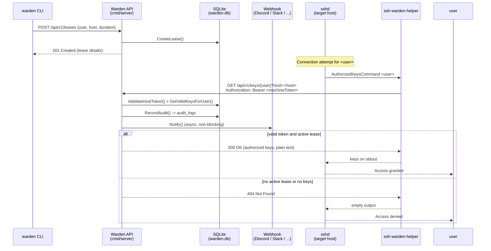

# SSH-Warden Architecture

SSH-Warden is a **Just-In-Time (JIT) SSH access broker**. Instead of granting
open-ended SSH access, it issues short-lived, revocable *leases* that authorize
a given user to connect to a given host. When a host's OpenSSH server receives
a connection, it asks SSH-Warden — in real time — which public keys are
currently authorized, and only those keys are accepted.

This document describes the end-to-end flow, the component layout, the key
technological trade-offs and the threat model.

---

## 1. High-level flow



### Step-by-step

1. **Lease request** — The `warden` CLI asks the API for a lease: a specific
   user against a specific target host (or `*`) for a bounded duration.
2. **Key check on connect** — When `sshd` on a target host receives a
   connection, it runs `ssh-warden-helper <username>` as its
   `AuthorizedKeysCommand`.
3. **Machine authentication & authorization** — The helper calls the API with
   the machine's host token as a `Bearer` token plus the machine's host
   identity. The API validates the token (constant-time hash comparison) and
   then checks whether the user holds an active lease covering the host. It
   returns the user's public keys, or `404` if none.
4. **Audit & notification** — Every decision (granted, denied, or failed host
   authentication) is written to `audit_logs` and optionally forwarded to a
   webhook asynchronously.

---

## 2. Component layout

```
cmd/server       HTTP API, database bootstrap, graceful shutdown, webhooks
cmd/cli          `warden` client: leases, keys, status, revoke, audit, config
cmd/helper       `ssh-warden-helper` — the OpenSSH AuthorizedKeysCommand
internal/api     chi router, handlers, middleware (host token auth)
internal/database SQLite persistence (users, keys, leases, hosts, audit_logs)
internal/models  Shared data structures (User, SSHKey, Lease, Host, AuditLog)
internal/webhook Asynchronous outbound notifications (Discord / generic JSON)
pkg/sshutil      Public-key validation & normalization
```

### cmd/server

The HTTP front end. It opens the SQLite database, runs optional seed data,
builds the chi router (`internal/api`) and serves it until a signal triggers
graceful shutdown. It reads the optional `WARDEN_WEBHOOK_URL` and wires the
`webhook.Notifier` into the API.

### cmd/cli

A Cobra-based command-line client. It resolves its API endpoint and default
user through a precedence chain (flags → environment → `config.yaml` → OS
defaults), implements the audit viewer, and returns non-zero on failure.

### cmd/helper

A single-purpose static binary. It takes the SSH username as its only
argument, fetches the user's authorized keys from the API and prints them to
stdout for OpenSSH to consume. It never listens, never runs as a daemon, and
exits immediately — the ideal shape for an `AuthorizedKeysCommand`.

### internal/api

Wraps the db and webhook dependencies in a `Server` struct and constructs a
[`chi`](https://github.com/go-chi/chi) router. It owns the `hostAuth`
middleware that guards key-fetch endpoints with host-token authentication, and
every handler that records an audit event also triggers a webhook notification.

### internal/database

Pure-Go SQLite (via `modernc.org/sqlite`, no CGO) with WAL journal mode and
foreign keys enabled. It is the single source of truth for users, SSH keys,
leases, host tokens and the audit log.

### internal/webhook

Fire-and-forget notifications. `Notify()` never blocks the caller: delivery
runs in a goroutine behind a strict 3-second HTTP timeout. The payload format
is detected from the webhook URL (Discord embeds vs generic JSON).

### pkg/sshutil

Parses, validates and normalizes raw public keys before they are stored or
served, so the database and the `authorized_keys` output always hold a
consistent canonical form.

---

## 3. Technology choices

| Decision | Rationale |
|----------|-----------|
| **SQLite with WAL** | Zero-config persistence, ideal for a single-node tool. WAL allows concurrent readers with the single writer, keeps read latency low during audit writes, and survives all data in one portable file (`warden.db`). |
| **Pure-Go SQLite (no CGO)** | `modernc.org/sqlite` is a CGO-free translation of SQLite, so every binary — including the helper deployed to target hosts — is a static, dependency-light native build with no libc/`libsqlite` requirements. |
| **Zero-daemon helper** | `ssh-warden-helper` runs once, prints keys, and exits. There is nothing to babysit, restart, or harden in the background on every target host. |
| **Async webhooks** | Notifications must never add latency to the authorization decision, so they are delivered asynchronously with a hard timeout. |
| **chi router** | Lightweight, composable middleware, conventional route handling, no external config surface. |
| **Cobra CLI** | Idiomatic flag parsing, subcommand groups, generated help — reduces bespoke argument handling. |

Cross-compilation is straightforward: `GOOS=linux GOARCH=amd64 go build ...`
yields a static binary suitable for the smallest scratch/`alpine` images and
for copying onto target hosts.

---

## 4. Data model

- **users** — `id`, unique `username`, `created_at`.
- **ssh_keys** — `user_id`, normalized `public_key`, `comment`, `created_at`.
- **leases** — `user_id`, `target_host` (or `*`), `expires_at`, `reason`. A
  lease is what gives a key *authority*; without a non-expired lease the key is
  ignored.
- **hosts** — `hostname`, `token_hash` (SHA-256 of the host token, never the
  token itself).
- **audit_logs** — `username`, `target_host`, `action`, `reason`, `client_ip`,
  `created_at`, indexed on `created_at` and `username`.

A key is served to OpenSSH only when the user has **both** a registered key
and an active lease covering the requested host:

```
SELECT DISTINCT k.public_key
FROM ssh_keys k
JOIN users u ON u.id = k.user_id
JOIN leases l ON l.user_id = u.id
WHERE u.username = ?
  AND l.expires_at > now
  AND (l.target_host = ? OR l.target_host = '*');
```

---

## 5. Threat model

### Trust boundaries

- **Client → API**: the API trusts the `warden` client. In production this
  channel must be TLS-terminated at a reverse proxy (see `security.md`).
- **Helper → API**: the API authenticates the *machine* via a shared host
  token. Anyone holding a valid host token for a host can impersonate that
  host.
- **API → Database**: same process; the DB file must be readable/writable only
  by the service account.

### Assets

- Host tokens (and their SHA-256 digests in `hosts`).
- Public keys, users, leases.
- The audit log (a tamper-evident record of who was authorized when).

### Threats and mitigations

| Threat | Mitigation |
|--------|------------|
| **Host-token theft / replay** | Tokens are never stored in plaintext in the DB — only their SHA-256 digest is. Leaked DB rows do not expose usable tokens. |
| **Timing attacks on token comparison** | The digest is compared with a constant-time operation (`subtle.ConstantTimeCompare`), so an attacker cannot infer the digest via response timing. |
| **Key or token sniffing in transit** | Terminate TLS at a reverse proxy in production; never expose the API over plain HTTP on an untrusted network. |
| **Stolen private key** | Access still requires a valid, unexpired lease for the target host — a single key alone grants nothing. Leases are Just-In-Time and revocable. |
| **Helper abuse on a target host** | The helper runs as `nobody` (see `installation.md`), reads only `/etc/ssh-warden/token`, and performs a single outbound call. It cannot modify the system or persist state. |
| **Unbounded access** | Leases expire automatically (`expires_at`); no manual cleanup needed. |
| **Audit-log forgery** | Audit writes happen server-side, single-writer, and are the authoritative record. Restrict DB file permissions. |
| **Log noise / webhook flooding** | Notifications are optional and driven by a configurable `WARDEN_WEBHOOK_URL`; the API response path never blocks on them. |

### Non-goals (current scope)

- mTLS between hosts and the API (roadmap).
- Web UI and approval workflows (roadmap).
- Relying solely on the audit log for *post-hoc* forensics: the log is strong
  operational evidence but is not an append-only, externally-write-protected
  journal.